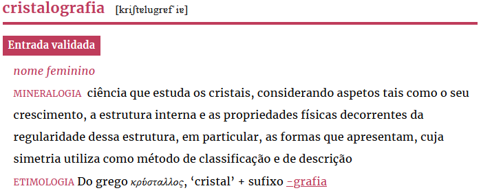

# Guidelines for Encoding Domain Labels in RDF Using in OntoLex
###  Fahad Khan, Ana Salgado, Bruno Almeida, Sara Carvalho, Rute Costa, Margarida Ramos and Raquel Silva

## Domain Labels - An Introduction

Domain labels are tags associated with individual lexicographic articles or senses in a dictionary or similar lexicographic resource which indicate that a lexical unit or a specific sense belongs to a specialised domain, e.g., Sport or Medicine. Dictionary domain labels can be organised in terms of taxonomies or thesauri, something which makes the original resource easier to navigate and to integrate with other datasets. Such labels play an important role in many lexicographic resources but there hasn’t been much work on modelling these in linked data in a way that better exploits the possibilities of the Semantic Web stack. 

### Background

Applying a usage label to a lexical unit implies that it moves away ‘in a certain respect, from the main bulk of items described in a dictionary, and that its use is subject to some kind of restriction’ (Svensén, 2009, p. 313). The need to label certain deviations (e.g., when the language register is familiar) and restrictions (if a particular unit belongs to a domain field) originated in what is currently called marking or diasystematic marking (Hausmann, 1989, p. 651).

The domain labelling, a particular dictionary feature, takes our attention through this research. We focus on diatechnical information/marking which indicates that a given unit belongs to a particular domain. Bearing in mind that knowledge is complex, Sager (1990) states, ‘In practice, no individual or group of individuals possesses the whole structure of a community’s knowledge; conventionally, we divide knowledge up into subject areas, or disciplines, which is equivalent to defining subspaces of the knowledge space.’ (p. 16). In sum, a domain is a ‘field of special knowledge’ (ISO 1087, 2019, p. 1). This definition has the advantage of being transparent and sufficiently comprehensive.

In the universe of the labelling system commonly used in lexicography, the labels assigned to these specialised senses are called domain labels, which are defined as a ‘marker which identifies the specialised field of knowledge in which a lexical unit is mainly used’ (Salgado, Costa & Tasovac, 2019). These labels are used ‘para señalar el léxico temáticamente especializado, en contraposición al léxico común’ [to signal the thematically specialised lexicon in contrast to the common lexicon] (Estopà, 1998, p. 1) and are generally expressed in the form of abbreviations (remember the economy of space rationale in the paper format).

The designation domain label is not consensual. Atkins and Rundell (2008), referring to ‘linguistic labels’, classified specialised vocabulary as ‘domains’ (p. 182); they are termed ‘field labels’ according to Verkuyl, Janssen and Jansen (2003, p. 7), ‘marcas técnicas’ by Fajardo (1996/1997), ‘marca de materia’ (Martínez de Sousa, 1995), ‘marca terminológica’ in Lara (1997), ‘marcas temáticas’ in Estopà (1998), ‘field label’ (Hartmann & James, 1998/2002), ‘marca de especialidad’ (Nomdedeu Rull, 2008), or ‘diatechnical information/marking’ (Hausmann, 1989; Svensén, 2009). In our research framework, we prefer the term ‘domain label’ because it seems to be a transparent and recognisable designation for lexicographers, as well as a beacon for terminologists. Therefore, we use the term domain label to indicate abbreviations (e.g., Geol.) collected in our lexicographic corpus but also to mention the extensions of each of the abbreviations written in full, e.g. GEOLOGIA [GEOLOGY]).

Meanwhile, we must recognise that, in general dictionaries, the usage of domain labels is neither entirely satisfactory nor consistently efficacious as it is applied with subjective criteria. Assigning domain labels to lexical units has always been a challenging issue for any lexicographer. In addition to the domain label, linguistic formulae are used in the definitions, contexts and other indicators to point to specialised meanings. They are faced with difficult decisions such as: What domain label should be assigned to this specific specialised meaning? Should a domain label be assigned to a meaning that once was specialised, but nowadays belongs to the common knowledge? These are decisions that the lexicographer takes in a solitary way. 
Assuming that the unmarked lexicon belongs to the general lexicon, as we shall see, is a controversial matter. In fact, not every lexical unit that can be considered a term is marked. It is unclear if this is due to forgetfulness or if the lexicographer decided to apply different criteria. In most cases, we can only limit ourselves to making assumptions, given the lack of introductory and explanatory texts in the dictionary on the methodology and criteria that have been followed. On the other hand, by comparing different lexicographic resources, we identify imbalanced criteria for selecting domains. The coexistence of generic domains with smaller spectrum domains is one of the problems.

### Examples
In what follows we will take our examples from the Portuguese Academy Dictionary and ....
## Relevant Semantic Web Vocabularies
## Ontolex-Lemon, Lexinfo and Lexicog
We will assume a basic knowledge of the [OntoLex-Lemon vocabulary](https://www.w3.org/2016/05/ontolex/), its extension dealing with lexicographic resources the [OntoLex-Lemon Lexicography Module (Lexicog)](https://www.w3.org/2019/09/lexicog/), and the [Lexinfo vocabulary](https://lexinfo.net/) which allows for the addition of more specific linguistic information to RDF vocabularies (specifying for instance part of speech information). 

The [original lemon model](https://lemon-model.net/) (on which OntoLex-Lemon was based) allowed for the addition of topic information to entries with the ```lemon:topic property``` and more pertinently the use of ```lemon:context``` to specify the technical register of a sense.  The latest version of OntoLex-Lemon does not contain these properties. The [guidelines](https://www.w3.org/2016/05/ontolex/) do however suggest the use of the ```dct:subject``` property to specify 
> under which conditions (context, register, domain, etc) it is valid to regard the lexical entry as having the ontological entity as meaning.


In addition the Ontolex guidelines mention the ```ontolex:usage``` property which is defined as indicating 
> usage conditions or pragmatic implications when using the lexical entry to refer to the given ontological meaning 

this property has the domain of ```ontolex:LexicalSense``` and the range ```rdfs:Resource```. In the lexinfo vocabulary we have subproperties of ```ontolex:usage```, including ```lexinfo:domain``` which is defined as a 
>usage marker which identifies the specialized field of knowledge in which a lexical unit is mainly used.

Ontolex therefore seems to offer us a way of marking a lexical entry as belonging to a certain domain (this is useful in case a term is only used in a technical sense) and a way of specifying that a specific sense of an entry is associated with a particular domain. 
<!--- When the meaning specified refers to a specific technical sense of a word belonging to a domain **we recommend using the ```ontolex:LexicalConcept``` class** ---> 
We recommend encoding the domain label as a SKOS ```concept``` and using the ```skos:narrower``` and ```skos:broader``` relations to encode the relations between different domains. In the following examples we will look at how to encode several different kinds of examples of domain labels, trying to capture several different varieties of use case. 

To summarise 

### Cristalografia

In the first example we show how to encode an entry which has a sense that has been marked with a domain label. In this case the entry is for the Portuguese word _cristalografia_ 'crystallography' from the Portuguese Academy Dictionary which as the following diagram shows has one sense and this sense is marked with the label MINERALOGIA referring to the domain of mineralogy. 


](Examples/cristalografia_DLP.png "Cristalografia Example")
<!---->

Some additional information which is relevant for our example is that the domain of MINERALOGIA in the Portuguese Academy Dictionary subject hierarchy is a subdomain of GEOLOGIA 'geology' which is in turn a subdomain of CIENCAS DA TERRA 'earth sciences'.  We can represent the entry as follows in RDF using the following vocabularies: OntoLex-Lemon, lexinfo, and SKOS.

      @prefix lexinfo: <http://www.lexinfo.net/ontology/3.0/lexinfo#> .
      @prefix ontolex: <http://www.w3.org/ns/lemon/ontolex#> .
      @prefix rdf: <http://www.w3.org/1999/02/22-rdf-syntax-ns#> .
      @prefix skos: <http://www.w3.org/2004/02/skos/core#> .

      <http://example.org/class/DLP_cristalografia> a ontolex:LexicalEntry ;
          lexinfo:etymology [ rdf:value "Do grego κρύσταλλος cristal + sufixo -grafia"@pt ] ;
          lexinfo:gender lexinfo:feminine ;
          ontolex:canonicalForm [ 
                                  ontolex:phoneticRep "kriʃtɐluɡrɐˈfiɐ"@pt ;
                                  ontolex:writtenRep "cristalografia"@pt 
                                  ] ;
          ontolex:sense [ lexinfo:domain <http://example.org/class/mineralogia>;
                  skos:definition """ciência que estuda os cristais, considerando aspetos tais como o seu crescimento, a
                  estrutura interna e as propriedades físicas decorrentes da regularidade dessa estrutura,
                  em particular, as formas que apresentam, cuja simetria utiliza como método de
                  classificação e de descrição"""@pt ] .


      <http://example.org/class/mineralogia> rdf:type  skos:Concept; 
          skos:prefLabel "mineralogia"@pt;
          skos:prefLabel "minerology"@en; 
          skos:narrower <http://example.org/class/geologia> .
      <http://example.org/class/geologia> rdf:type  skos:Concept; 
          skos:prefLabel "geologia"@pt;
          skos:prefLabel "geology"@en; 
          skos:narrower <http://example.org/class/ciencas_da_terra> ;
          skos:broader <http://example.org/class/mineralogia> .
      <http://example.org/class/ciencias_da_terra> rdf:type  skos:Concept;
          skos:prefLabel "ciencias da terra"@pt;
          skos:prefLabel "earth sciences"@en; 
          skos:broader <http://example.org/class/mineralogia> .

# References

Svensén, B. (2009). A Handbook of Lexicography: The Theory and Practice of Dictionary Making. Cambridge: Cambridge University Press.

Hausmann, F. J. (1989). Die Markierung in eineim allgemeinen einsprachigen Wörterbuch: eine Übersicht. In F. J. Hausmann, O. Reichmann, H. E. Wiegand, L. Zgusta (Eds.), Wörterbücher. Ein internationales Handbuch zur Lexikographie (pp. 649–657). Berlin: Walter de Gruyter.

Sager, J. C. (1990). A practical course in terminology processing. Amsterdam: John Benjamins Publishing Company.

ISO 1087. (2019). Terminology Work – Vocabulary – Part 1: Theory and Application. Geneva: International Organization for Standardization.

Salgado, A., Costa, R. & Tasovac, T. (2019). Improving the consistency of usage labelling in dictionaries with TEI Lex-0. Lexicography: Journal of ASIALEX, 6(2), 133–156. doi:10.1007/s40607-019-00061-x.

Estopà, R. B. (1998). El léxico especializado en los diccionarios de lengua general: las marcas temáticas. Revista de la Sociedad Española de Linguística, 28(2), 359–387.

Atkins, B. T. S., & Rundell, M. (2008). The Oxford Guide to Practical Lexicography. New York: Oxford University Press.

Verkuyl, H. J., Janssen, M., & Jansen, F. (2003). The codification of usage by labels. In Sterkenburg, P. (Ed.), A practical guide to lexicography (pp. 297–311). Amsterdam: John Benjamins. doi:10.1075/tlrp.6.33ver.
